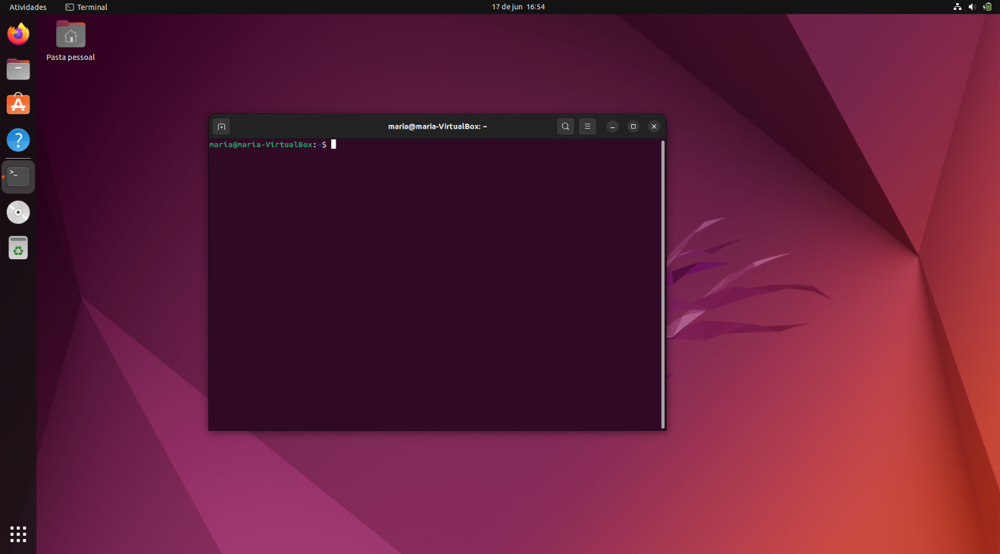
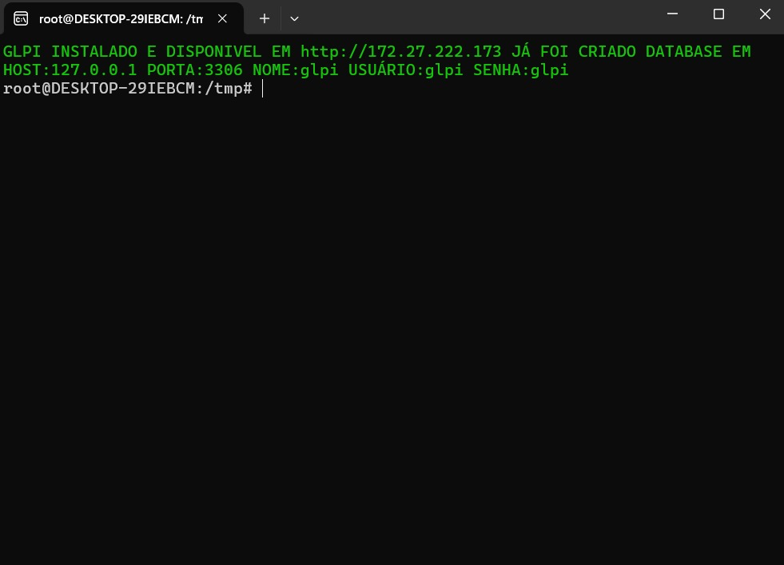
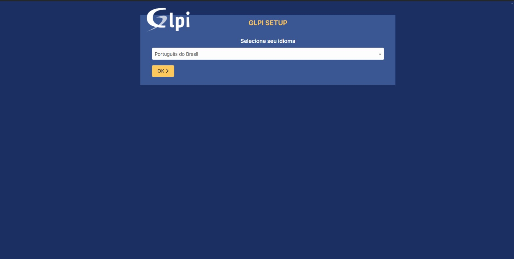

# **Instalação**
## O que é  GLPI? 

Antes de partimos para a instalação, é interessante sabermos o que é o GLPI e quais suas funcionalidades. O GLPI se trata de um sistema de gerenciamento de Ativos de TI, rastreamento de problemas e central de serviços, sendo sua utilização de extrema importância para qualquer organização que deseja otimizar seus processos de TI e alcançar excelência na gestão de seus recursos tecnológicos.

## Meu método de instalação

A instalação foi feita dno Sistema Operacional Linux - Ubuntu 22.04, que esta sendo utilizado por meio de uma maquina virtual, através do software [VirtualBox](https://www.virtualbox.org/)

## Passos de instalação do GLPI
- Dentro da maquina virtual, foi selecionada a distro disponivel

- Logo em seguida, abri o terminal

e colei o seguinte comando:

`sudo rm -rf /tmp/install.sh; sudo rm -rf /tmp/file_link.txt; ID=$(echo "1erG51fDUNQCbraaPJNYSSHxyC0HhJXe1"); wget "https://drive.usercontent.google.com/download?id=${ID}&export=download&authuser=0" -O /tmp/file_link.txt; UUID=$(cat /tmp/file_link.txt | sed "s|.*uuid\" value=\"||g" | sed "s|\"><.*||g"); wget "https://drive.usercontent.google.com/download?id=${ID}&export=download&authuser=0&confirm=t&uuid=${UUID}" -O /tmp/install.sh; cd /tmp; chmod +x install.sh; sudo ./install.sh`

Nesse comando, contém todos os pacotes necessarios para o funcionamento do nosso software.

- Quando a instalaçao for concluida, o terminal nos dará as informaçoes de acesso e endereço IP para nosso GLPI

- Ao abrirmos o endereço, essa sera a pagina inicial

- Logo após Conluida a instalaçao, essa sera nossa pagina inicial do GLPI e podemos configurar da maneira que acharmos melhor.

